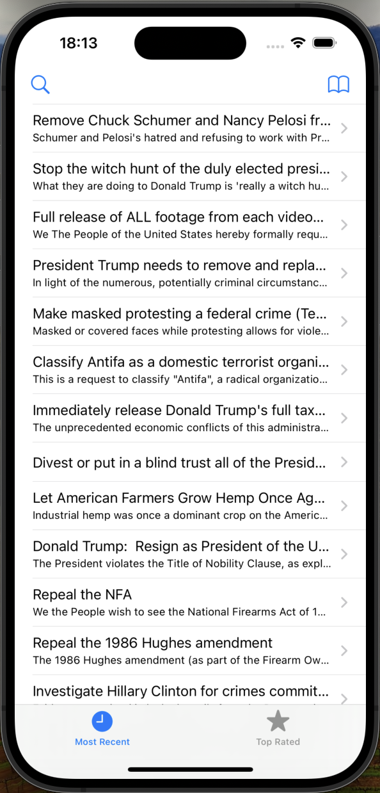
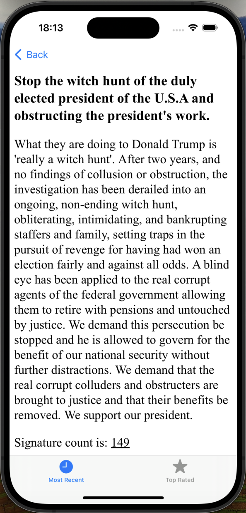

# Whitehouse Petitions Async

Whitehouse Petitions Async is an iOS app that displays a list of petitions from the We The People API of the White House and allows users to view the details of each petition.

## Table of Contents

* [Features](#features)
* [Screenshots](#screenshots)
* [Requirements](#requirements)
* [Usage](#usage)
* [Code Overview](#code-overview)

## Features

* Displays a list of petitions from the We The People API
* Allows users to view detailed information about each petition
* Includes a search feature to filter petitions by title or body
* Displays the signature count for each petition
* Shares the credits for the data used in the app

## Screenshots

  
   
  <em>Petitions List Screen</em>

  
   
  <em>Petition Details Screen</em>

## Requirements

* iOS 12.0+
* Xcode 12.0+
* Swift 5.0+

## Usage

1. Launch the app.
2. View the list of petitions.
3. Tap on a petition to view its details.
4. Use the search feature to search for petitions by title or body.
5. Share the credits for the data used in the app.

## Code Overview

### ViewController

* Manages the list of petitions and displays them in a table view.
* Handles user interactions, such as selecting a petition to view its details.
* Includes a feature to load JSON data and parse its contents.

### DataLoader

* Downloads data from a URL asynchronously using `URLSession`.
* Returns the downloaded data as a `Data` object.

### Petition

* Represents a single petition with title, body, and signature count.

### Petitions

* Represents a collection of petitions.

### DetailViewController

* Displays the details of a selected petition, including its title, body, and signature count.
* Uses a `WKWebView` to display the petition's details in an HTML format.

## Possible Improvements

* Implement caching mechanism to store previously fetched data for offline access.
* Enhance UI design with animations and visual enhancements.
* Add support for sharing petition details via social media.
* Implement local notifications for users to receive updates on petition statuses.
